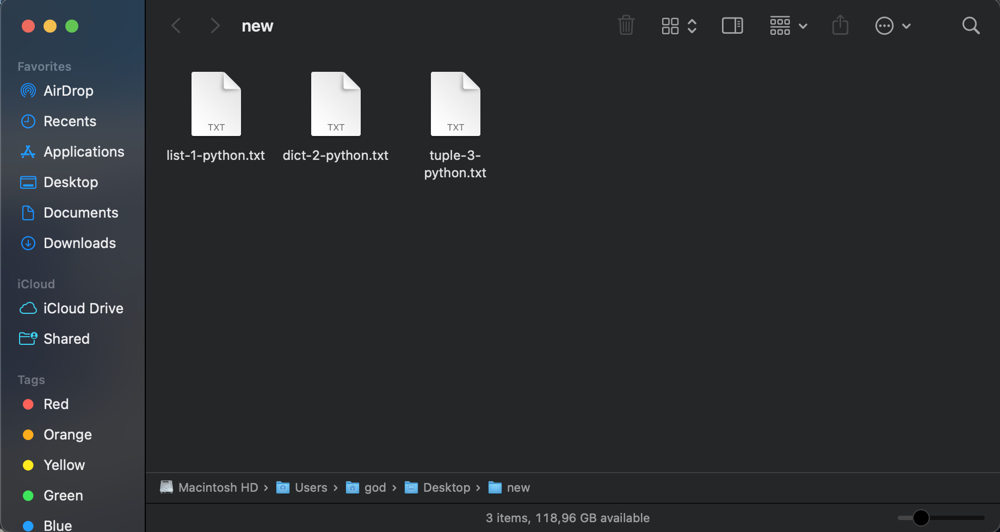
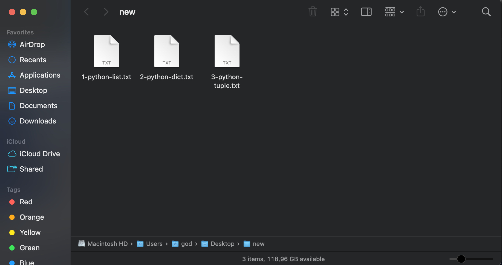

# File-Filter-Rename

Enter the path that has the files to filter    

Make sure : 

  that there is not empty space at the end of the path

  file names are like 1-xxxxxx-somethin.txt not like 12345.txt

  if your files have more than 3 variables (a-b-c-d.txt) than modify the code by adding {filtered[3]} at the variable called end_name

  
## Examples 

