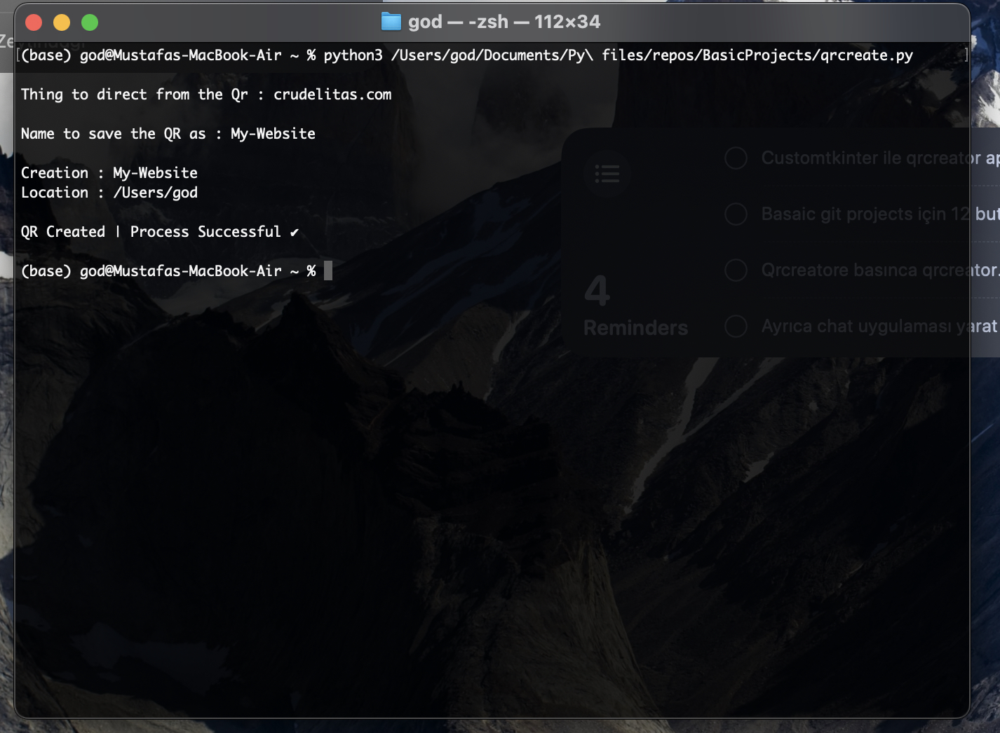

# Qr-Creator

## Install

    git clone https://github.com/OldKokoroz/Qr-Creator.git

    pip install qrcode

## Usage 

Program needs 2 inputs :

1 - Data to put in the Qr (Such as your website, a secret message maybe...)

2 - Name to save the Qr as

--- At the end, program shows where the file is saved ---

## Terminal 

## QR Example

